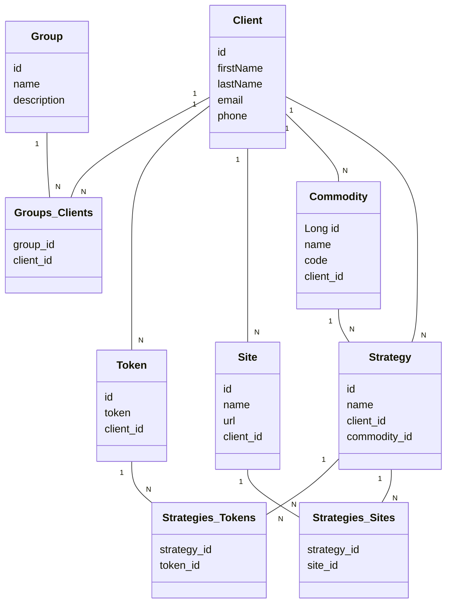

# M.I.D.A.S BackEnd

RESTful API para o projeto M.I.D.A.S da disciplina de Fábrica de Software.

## Principais Tecnologias
- **Java JDK 21**
- **Spring Boot 3**
- **Spring Data JPA**
- **PostgresSQL**
- **Lombok**
- **OpenAPI (Swagger)**

## Database

- O projeto contém um arquivo chamado docker-compose.yml. 
Nesse arquivo contém toda estrutura para subir o banco de dados PostgreSQL para rodar a aplicação.
Para subir o banco, basta ir até a pasta raiz do projeto e rodar o comando:

```bash
docker-compose up
```

## Diagrama de Classes


## Documentação da API (Swagger)

Para ter acesso a documentação da API, insira o seguinte link no navegador ao rodar o projeto em sua máquina local.
#### [http://localhost:8080/swagger-ui/index.html](http://localhost:8080/swagger-ui/index.html)
